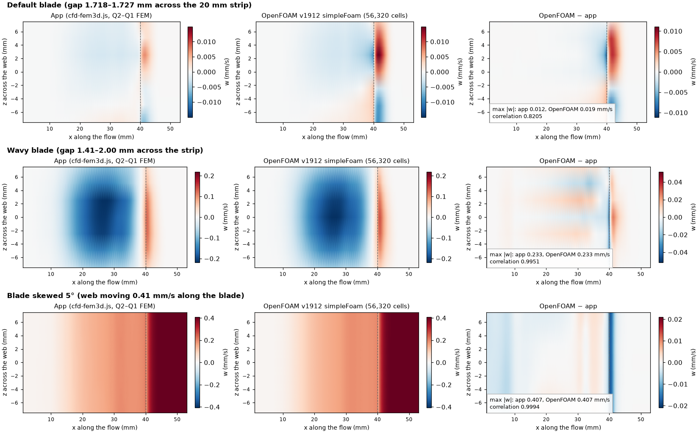
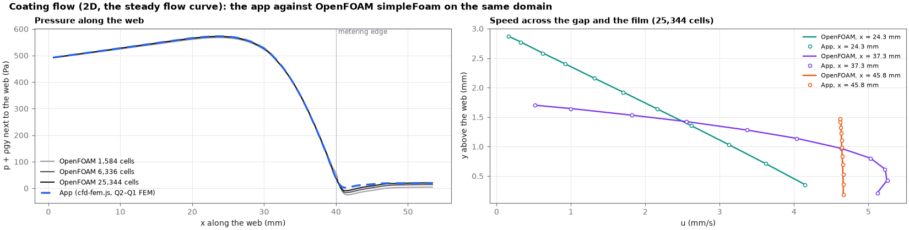
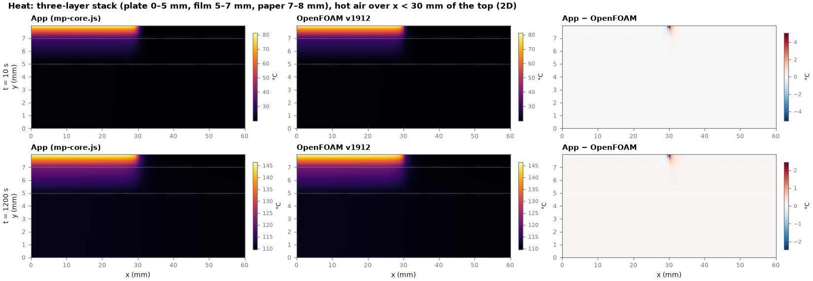
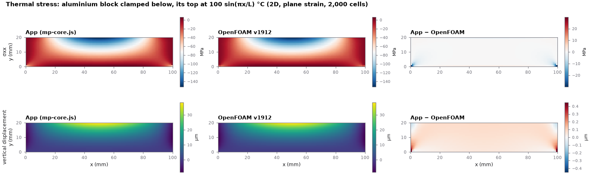
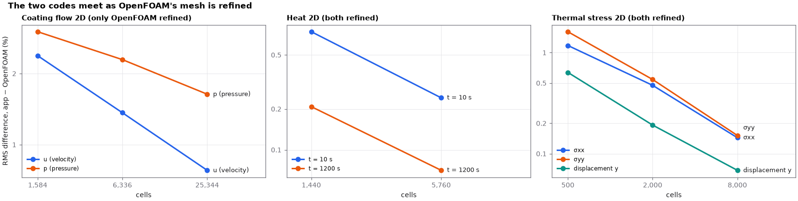
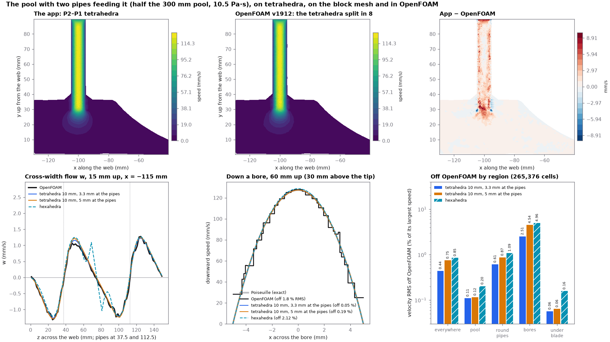

# Benchmarks against OpenFOAM

Independent checks of the app's solvers with **OpenFOAM v1912**, a professional open-source CFD and continuum-mechanics
code. Each benchmark runs the app's own solver (in the browser, or its `mp-core.js` engine in Node) and an OpenFOAM
solver on the same domain, the same materials and the same boundary conditions, and compares the fields cell by cell or
node by node. The scripts that make, run and compare every case are in this folder (see *Running it*).

## Summary

| What | The app | OpenFOAM | Dimensions | Result |
|---|---|---|---|---|
| Coating flow under the blade, free surface and contact line | `cfd-fem3d.js` (Taylor–Hood Q2–Q1 FEM, Newton) | `simpleFoam` (finite volumes, SIMPLEC) | 3D | u 1.4 %, p 2.0 % RMS (450,560 cells), falling with refinement; 0.3 % where the flow is smooth; the cross-web flow of the same size and pattern (correlation 0.995–0.999) |
| The same, in 2D | `cfd-fem.js` (Q2–Q1 FEM, Newton) | `simpleFoam` | 2D | u 0.8 %, p 1.6 % RMS (25,344 cells), falling with refinement; 0.1 % in the pool and under the blade; the film's flow rate OpenFOAM's own to 4 digits (1.5157 mm) |
| Heat through a three-layer stack (plate, film, paper), hot air on part of the top | `mp-core.js` `mpHeatMoisture` (the Pre heat and Drying stages' solver) and `mpTransport` (the Furnace's); linear FEM | `chtMultiRegionFoam` (one solid region per layer, coupled interfaces) | 2D, 3D | 2D: 0.07–0.24 % RMS of the temperature rise (5,760 cells), the hottest point within 0.03 K; 3D: 1.6–3.0 % on 1,920 cells, 0.8–1.7 % on 14,400 (the mesh about twice as fine each way), the hottest point 2.8 K → 0.4 K apart |
| Thermal stress in a clamped aluminium block | `mp-core.js` `mpScalar` + `mpElastic` (linear FEM) — the stages' stress solver | `solidDisplacementFoam` (thermal stress) | 2D (plane strain), 3D | 2D: displacement 0.07 %, stresses 0.1–0.15 % RMS (8,000 cells); 3D: displacement 0.3–0.4 %, stresses 0.4–1.3 % (30,720 cells); falling 2–3.5× per refinement |
| The pool behind the blade with two pipes feeding it, on the tetrahedral mesher's mesh | `feed-pool-tet.js` on `feed-fem.js` (Taylor–Hood P2–P1 tetrahedra, curved walls, Newton) | `simpleFoam` on the same tetrahedra, each split in 8 | 3D | see *The pool on tetrahedra*: in the pool and under the blade 0.06–0.12 % RMS (the block mesh 0.16–0.21 %); in the bores the app follows Poiseuille's exact flow (0.05–0.19 %) where OpenFOAM is 1.8–5.7 % off |
| The free surface itself (film thickness, meniscus) | `cfd-fem.js` | `interFoam` (volume of fluid) | 2D | **not achieved**: interFoam diverges on this flow (see *The free surface*) |

Two findings came out of the benchmarks:

1. **The 2D and the 3D coating solves use different slurry physics by default.** The 2D carries the slurry's structure
   (thixotropy, the Materials card's structure switch, on by default) along its flow; the 3D uses the steady flow curve
   (`ui-3d.js`: "the structure is the 2D's"; the guide says so too). At location 1 the 2D's wet film is 1.448 mm and the
   3D strip's 1.514 mm. With the same law (structure off) the 2D gives 1.5157 mm: the two solvers agree, the difference is
   the physics. OpenFOAM was given the steady law, so the 2D benchmark runs with the structure off.
2. **The free surface's shape is not independently checked.** OpenFOAM computes the flow in the app's solved shape and
   agrees with it, including the flow rate the shape carries; it does not find the shape by itself (below).

## Coating flow, 3D

1. `exp3d.js` runs the app's own Coating › 3D strip solve in the browser (as a user would) and saves its mesh, its
   fields (u, v, w, p at every node) and its inputs.
2. `ofstrip.py` writes that domain as an OpenFOAM case: the app's nodes are the hex mesh's vertices (refined further
   with `refineMesh`). Patches and conditions are the app's:

   | Patch | App (`cfd-fem3d.js`) | OpenFOAM |
   |---|---|---|
   | web | moving at U (and along the blade when skewed) with Beavers–Joseph/Navier slip, b = 1/webSlip (3 µm) | `partialSlip`, refValue the web's velocity, valueFraction 1/(1 + b·δ) per face (exact: `couette.py`) |
   | blade, exit face | no slip | `noSlip` |
   | free surface | solved (kinematic + stress conditions) | the app's solved shape, `slip` (no flow through, no shear) |
   | inlet (pool edge) | traction p = Pup − ρgy, no flow up (v = 0); w = 0 unless skewed | p + ρgy = Pup (gravity in the modified pressure); `directionMixed`: v (and w) fixed 0 |
   | outlet | the film moving with the web (plug) | `fixedValue` (U, 0, W) |
   | strip sides | symmetry planes (held at the infinite-blade solution when skewed) | `symmetry` (`cyclic` when skewed) |
   | viscosity | Herschel–Bulkley at √(γ̇² + γ̇min²) | `strainRateFunction` with a table of the app's own law |

3. `compare.py` reads OpenFOAM's result files and compares u, v, w and p at every interior node of the app's mesh
   (OpenFOAM's value there: the inverse-distance mean of the cells round the node). (This Debian build's function
   objects — `sample`, `probes` — fail with an internal SHA1 error, so the files are read directly.)

| Case | u: RMS diff / U | p: RMS diff / range | max \|w\| app / OpenFOAM (mm/s) | \|w\|/\|u\| app / OpenFOAM | w pattern correlation |
|---|---|---|---|---|---|
| Default blade, OpenFOAM 7,040 cells | 3.39 % | 4.11 % | 0.012 / 0.023 | 0.22 % / 0.41 % | 0.79 |
| Default blade, OpenFOAM 56,320 cells | 2.18 % | 2.88 % | 0.012 / 0.019 | 0.22 % / 0.35 % | 0.82 |
| Default blade, OpenFOAM 450,560 cells (iteration 1,500: the fields moved 0.02 % RMS (u) and 0.2 Pa RMS (p) since iteration 1,000) | 1.39 % | 1.97 % | 0.012 / 0.014 | 0.22 % / 0.26 % | 0.86 |
| Wavy blade (gap 1.41–2.00 mm across the strip), 56,320 cells | 2.12 % | 2.68 % | 0.233 / 0.233 | 4.11 % / 4.15 % | 0.995 |
| Blade skewed 5°, 56,320 cells | 2.24 % | 2.81 % | 0.407 / 0.407 | 7.68 % / 7.64 % | 0.9994 |

By region (RMS differences; the regions as in `compare.py`: the pool where the gap is wider than 2 H, the converging
gap under the blade, the metering corner with the exit face and the contact line (within 2 H of either), the film):

| Region | Default u / p, 7,040 cells | Default u / p, 56,320 cells | Default u / p, 450,560 cells | Wavy u / p | Skewed u / p |
|---|---|---|---|---|---|
| The pool upstream | 0.96 % / 0.64 % | 0.30 % / 0.29 % | 0.16 % / 0.18 % | 0.30 % / 0.27 % | 0.29 % / 0.21 % |
| Under the blade | 0.72 % / 0.70 % | 0.34 % / 0.30 % | 0.19 % / 0.18 % | 0.35 % / 0.30 % | 0.33 % / 0.23 % |
| The metering corner, exit face and contact line | 6.56 % / 6.69 % | 4.26 % / 4.99 % | 2.72 % / 3.69 % | 4.16 % / 4.67 % | 4.38 % / 4.92 % |
| The film after the contact line | 0.22 % / 4.77 % | 0.22 % / 2.84 % | 0.23 % / 1.22 % | 0.22 % / 2.60 % | 0.22 % / 2.69 % |

- Where the flow is smooth, the two codes agree to about 0.3 %. The differences sit at the sharp metering corner and
  the contact line, where the flow is singular; they fall as OpenFOAM's mesh is refined (7,040 → 56,320 → 450,560 cells: u
  3.4 → 2.2 → 1.4 %, p 4.1 → 2.9 → 2.0 %), and OpenFOAM's largest cross-web speed falls toward the app's
  (0.023 → 0.019 → 0.014 mm/s against 0.012).
- Cross-web flow: in the default case both codes find almost none (w ≈ 0.2–0.4 % of u): the strip's gap varies only
  1.718–1.727 mm across it and its sides are symmetry planes, so the flow is nearly two-dimensional, and the 3D
  streamlines run straight. Where the geometry drives cross-web flow — a gap varying across the web, a skewed blade —
  both codes find it, of the same size (0.233 and 0.407 mm/s) and the same pattern (correlations 0.995 and 0.9994).
  `results/w_maps.png`: w at half the gap, seen from above; `results/app_streamlines_top.png`: the app's own
  streamlines for the three cases.



## Coating flow, 2D

`exp2d.js` runs the app's Coating › 2D solve at location 1 and saves it in the 3D export's layout (one layer), so the
same `ofstrip.py` (front and back `empty`) and `compare.py` make and compare the case. The slurry: the steady
Herschel–Bulkley law (the structure switched off, see the findings).

| OpenFOAM cells | u: RMS / U | v: RMS / U | p: RMS / range | pool u / p | under the blade u / p | corner and contact line u / p | film u / p |
|---|---|---|---|---|---|---|---|
| 1,584 | 2.38 % | 1.46 % | 3.01 % | 0.64 / 0.42 % | 0.50 / 0.47 % | 4.64 / 5.44 % | 0.23 / 2.49 % |
| 6,336 | 1.37 % | 1.09 % | 2.29 % | 0.19 / 0.16 % | 0.23 / 0.17 % | 2.68 / 4.38 % | 0.23 / 1.26 % |
| 25,344 | 0.78 % | 0.73 % | 1.64 % | 0.09 / 0.08 % | 0.12 / 0.07 % | 1.52 / 3.20 % | 0.23 / 0.51 % |

**The film's flow rate from OpenFOAM alone.** With the outlet open (the level film's pressure there instead of the
plug), the flow rate is OpenFOAM's own result from the pool's pressure and the shape: 1.5155 mm (6,336 cells) and
1.5157 mm (25,344 cells) of wet film against the app's 1.5157 mm.

With the structure on (the app's default), the app's 2D pressure under the converging blade does not match OpenFOAM's
with the steady law (the film's pressure 84–94 Pa apart, growing with refinement: `results/2d_structure_on_*.json`) —
the expected sign that the two solved different physics, not a numerical error: switched off, they meet.



## The free surface

The free surface's shape — the wet film's thickness and where the meniscus meets the exit face — is the app's to
solve (kinematic and stress conditions on moving spines). OpenFOAM's check of it here is partial. The flow rate in
the app's shape (above) checks the flow, not the shape: any shape carries some flow. The shape is checked by the
surface's normal-stress balance, −p + τnn = γκ: OpenFOAM, which has no surface tension in these runs, finds the
pressure under the app's surface from the flow alone, and where the shape is right that pressure is the capillary
pressure of the shape's curvature. Along the surface (the nodes just under it, from the contact line to the outlet):

| OpenFOAM cells | RMS difference from the app's pressure | largest | γκ along the surface |
|---|---|---|---|
| 6,336 | 16.1 Pa | 31.4 Pa | 0 – 108 Pa |
| 25,344 | 10.1 Pa | 22.7 Pa | 0 – 108 Pa |

The difference falls as OpenFOAM's mesh is refined and is largest next to the contact line (x within 2 mm of the
exit face), where both codes' fields are singular; on the level film the two agree within 0.5 Pa. It is a consistency
check of the shape the app found, not a second, independent prediction of it.

The direct check — OpenFOAM finding the shape by itself with `interFoam` (volume of fluid: slurry and air, surface
tension 0.07 N/m, the 36.9° contact angle on the exit face, gravity; `vof/vof_of.py`) — was not achieved. interFoam
diverges in its first time step on this flow (slurry 10.5 Pa·s at 4.7 mm/s, Reynolds number about 10⁻⁴), also with
slurry only (no interface), with gravity off, with the air made 600 times more viscous, with PIMPLE outer iterations
and under-relaxation, with smaller steps, with the inlet closed and with limited schemes; `pimpleFoam` on the same mesh
and boundaries is stable. A dedicated free-surface Stokes solver (an ALE finite-element code) is the right tool for that
check; none is available here.

## Heat

`heat/heat_app.js` runs the app's two heat solvers on a dry stack, heat only: `mp-core.js` `mpHeatMoisture` with the
options the Pre heat and Drying stages use (linear elements, the conduction integrated at the nodes, BDF2 in time), and
`mpTransport` as the Furnace stage uses it (`"solver": "transport"`: lumped capacity, implicit Euler).
`heat/heat_of.py` writes and runs the same stack as an OpenFOAM `chtMultiRegionFoam` case: one solid region per layer,
the interfaces coupled (`turbulentTemperatureCoupledBaffleMixed`: the temperature and the heat flux continuous), the
same cells (one per element), the same time scheme's order (`backward` against BDF2, `Euler` against implicit Euler)
at the same step.

| | |
|---|---|
| Layers (bottom to top) | aluminium plate 5 mm (k 200 W/m K, ρ 2700, c_p 900); film 2 mm (k 0.5, ρ 1500, c_p 1000); paper 1 mm (k 0.1, ρ 800, c_p 1300) |
| Top | hot air 200 °C, h = 50 W/m² K, over x < 30 mm (2D) or x < 30, z < 20 mm (3D: a quarter of the top); the rest insulated |
| Bottom | cool air 20 °C, h = 10 W/m² K |
| Sides | insulated |
| Domain, mesh | 60 mm (× 40 mm in 3D) × 8 mm; 60 × 24 cells (2D), 120 × 48 (2D refined); 16 × 12 × 10 and 30 × 24 × 20 (3D) |
| Time | from 20 °C; compared at 10, 60, 300 and 1200 s; step 0.1 s (2D), 2 s (3D) |

RMS difference over all cells, as a share of the temperature rise (T_max − 20 °C), and the hottest point:

| App solver (stages) | Case | 10 s | 60 s | 300 s | 1200 s | hottest point at 1200 s, app / OpenFOAM |
|---|---|---|---|---|---|---|
| `mpHeatMoisture` (Pre heat, Drying) | 2D, 1,440 cells | 0.74 % | 0.56 % | 0.38 % | 0.21 % | 145.41 / 145.32 °C |
| | 2D, 5,760 cells | 0.24 % | 0.18 % | 0.13 % | 0.07 % | 146.47 / 146.44 °C |
| | 3D, 1,920 cells (step 2 s) | 3.37 % | 3.13 % | 2.69 % | 2.24 % | 122.04 / 120.86 °C |
| `mpTransport` (Furnace) | 2D, 1,440 cells | 0.65 % | 0.47 % | 0.32 % | 0.17 % | 145.38 / 145.32 °C |
| | 3D, 1,920 cells (step 2 s) | 3.03 % | 2.54 % | 2.08 % | 1.59 % | 123.67 / 120.89 °C |
| | 3D, 14,400 cells (step 2 s) | 1.66 % | 1.31 % | 1.07 % | 0.80 % | 124.45 / 124.02 °C |

- By layer (2D, 5,760 cells, 1200 s): plate 0.04 %, film 0.04 %, paper 0.12 %.
- In 3D the difference halves when the mesh is made about twice as fine each way (1,920 → 14,400 cells); the coarse
  3D has 3 cells through the 1 mm paper, where the temperature falls steepest, and that is where most of it sits.
- A cost found on the way: both heat solvers factor their band matrix anew at every time step (`mpHeatMoisture` a
  non-symmetric one). At 30 × 24 × 20 elements and 2,400 steps that is hours to tens of hours, so the 3D benchmarks
  run with 2 s steps (600 steps). Reusing the factors while the matrix does not change is listed as a task.
- The largest local difference sits in the paper at the heated patch's edge (x = 30 mm), where the boundary condition
  steps from hot air to insulated: the finite elements carry a continuous temperature across that step, the finite
  volumes one value per cell. It halves when both meshes are refined (8.9 K → 5.1 K at 10 s; 4.5 K → 2.5 K at 1200 s).



## Thermal stress

`stress/stress_app.js` runs the app's solid solvers — `mp-core.js` `mpScalar` (the steady temperature) and
`mpElastic` (small-strain elasticity with the thermal eigenstrain α T, plane strain in 2D; linear elements, as the
stages' stress meshes) — and `stress/stress_of.py` the same block as an OpenFOAM `solidDisplacementFoam` case (finite
volumes, segregated, `thermalStress yes`, iterated to a steady state), on the same cells.

| | |
|---|---|
| Block | aluminium, 100 × 20 mm (× 50 mm in 3D); E 70 GPa, ν 0.33, α 23 × 10⁻⁶ /K, k 200 W/m K |
| Bottom | clamped, held at 0 °C (the stress-free temperature) |
| Top | free, held at 100 sin(πx/L) °C (× sin(πz/L_z) in 3D) |
| Sides | free, insulated; 2D: plane strain |

RMS differences: the temperature and the displacement as a share of their largest values, the stresses of the
largest stress, away from the clamped bottom corners (edges in 3D) where the elastic stress is singular:

| Case | T | u_x | u_y | u_z | σxx | σyy | σzz | σxy | largest \|u\|, app / OpenFOAM |
|---|---|---|---|---|---|---|---|---|---|
| 2D, 500 cells | 0.08 % | 0.49 % | 0.64 % | | 1.18 % | 1.61 % | 0.84 % | 0.87 % | 38.47 / 38.05 µm |
| 2D, 2,000 cells | 0.02 % | 0.17 % | 0.19 % | | 0.48 % | 0.54 % | 0.30 % | 0.34 % | 39.55 / 39.45 µm |
| 2D, 8,000 cells | 0.006 % | 0.07 % | 0.07 % | | 0.14 % | 0.15 % | 0.08 % | 0.10 % | 40.06 / 40.05 µm |
| 3D, 3,840 cells | 0.24 % | 0.70 % | 1.32 % | 1.33 % | 1.93 % | 3.85 % | 2.18 % | 1.06 % | 30.24 / 28.74 µm |
| 3D, 30,720 cells | 0.06 % | 0.28 % | 0.42 % | 0.42 % | 0.86 % | 1.30 % | 1.01 % | 0.41 % | 31.67 / 31.07 µm |

The differences fall 2–3.5× each time both meshes are halved: the two codes converge to the same solution.
The peak stress itself sits at a clamped corner, where it is singular and grows with refinement in both codes (2D:
229 MPa in the app, 259 MPa in OpenFOAM at 8,000 cells); it is not a number either code can give.





## The pool on tetrahedra

`pooltet.js` solves the pool of `feed-pool.validate.js`'s "tips in the paste in 3D" with the app's tetrahedral path —
um-tetgeom.js's solid, um-tetmesh.js's tetrahedra made quadratic (the pipes' walls and the blade's underside on their true
surfaces), feed-fem.js's P2–P1 elements — and writes the same case for OpenFOAM: the app's tetrahedra each split in 8 at
its edges' middles, so every node of the app's mesh is a point of OpenFOAM's. Half the 300 mm pool (the middle a mirror),
two pipes (10 mm bore, 14 mm outside, tips 30 mm above the web, bores 60 mm) feeding 10 ml/s, 1.07 ml/s out at the pool
edge, a Newtonian paste of 10.5 Pa·s and 1360 kg/m³, the web at 0.28 m/min.

| Patch | App | OpenFOAM |
|---|---|---|
| web | moving at U | `fixedValue` (U, 0, 0) |
| blade, side plate, pipes (outside, end, bore) | no slip | `noSlip` |
| the middle (z = W/2) | mirror | `symmetryPlane` |
| back edge (the cut) | no flow through it, no shear | `slip` |
| top (a lid at the level) | rising at ḣ through it, no shear | `fixedNormalSlip`, (0, ḣ, 0) with ḣ from OpenFOAM's own top area |
| bores' tops | a plug inside each bore's rim (the wall holds the rim), each pipe's equal share of the flow in exact | `fixedValue`, the flow in exact on OpenFOAM's own area |
| pool edge | the traction −ρg(h − y) | the app's velocity there, each face's mean (the app's flow out exactly); the pressure compared about its volume mean |

Gravity is in the app's pressure: OpenFOAM's (kinematic, no gravity) times ρ is compared with p − ρg(h − y). Each
solution is compared at every OpenFOAM cell centre (the app's value there from its own elements), RMS over the cells
weighted by their volumes, the velocity as a share of OpenFOAM's largest speed (123–129 mm/s, in the bores), the pressure
of its range (17.7–23.6 kPa, mostly the bores' drop). Where the bores' flow is developed (10 mm below their tops to 10 mm
above the tips) the exact answer is known, Poiseuille's: v = −2V̄(1 − r²/R²) and a pressure gradient of 8μV̄/R² (213.9
kPa/m for p − ρg(h − y)); every solution, OpenFOAM's too, is measured against it there. OpenFOAM's simpleFoam runs to
residuals below 1e-11 with two non-orthogonal correctors and U relaxed to 0.7 on every mesh: with one and 0.9 the finest
diverged, and its converged answer moves with U's relaxation (0.9 against 0.7 on the 10 mm mesh: 0.7 % of the largest
speed at most, the tables' figures by 0.26 points at most).

OpenFOAM's three meshes are the app's tetrahedra split in 8: 10 mm and 7 mm with 2 elements across a bore (5 mm round
the pipes), and 10 mm with 3 across (3.3 mm). Velocity / pressure RMS off OpenFOAM:

OpenFOAM on the 10 mm mesh, 2 across a bore (96,856 cells, 2,975 iterations):

| Region | Tetrahedra 10 mm (12,107 P2–P1, 60,279 unknowns; OpenFOAM's own) | Tetrahedra 7 mm (28,210; 134,836) | Block mesh (3,072 Q2–Q1; 86,943; the Pool and feed page's) |
|---|---|---|---|
| Everywhere | 1.05 % / 1.00 % | 1.06 % / 0.99 % | 1.15 % / 1.04 % |
| The pool away from the pipes and the pool edge | 0.11 % / 0.13 % | 0.10 % / 0.13 % | 0.21 % / 0.14 % |
| Round the pipes, outside the bores (within 15 mm of an axis) | 1.05 % / 0.19 % | 1.09 % / 0.18 % | 1.12 % / 0.19 % |
| In the bores | 6.56 % / 6.62 % | 6.59 % / 6.54 % | 7.12 % / 6.94 % |
| Under the blade near the pool edge | 0.09 % / 0.12 % | 0.09 % / 0.11 % | 0.18 % / 0.13 % |

OpenFOAM on the 7 mm mesh, 2 across (225,680 cells, 5,152 iterations):

| Region | Tetrahedra 10 mm | Tetrahedra 7 mm (OpenFOAM's own) | Block mesh |
|---|---|---|---|
| Everywhere | 1.05 % / 0.97 % | 1.04 % / 0.96 % | 1.17 % / 1.02 % |
| The pool away from the pipes and the pool edge | 0.12 % / 0.13 % | 0.11 % / 0.12 % | 0.21 % / 0.14 % |
| Round the pipes, outside the bores | 1.10 % / 0.18 % | 1.02 % / 0.18 % | 1.21 % / 0.19 % |
| In the bores | 6.56 % / 6.44 % | 6.50 % / 6.37 % | 7.18 % / 6.75 % |
| Under the blade near the pool edge | 0.08 % / 0.11 % | 0.08 % / 0.11 % | 0.17 % / 0.12 % |

OpenFOAM on the 10 mm mesh, 3 across a bore (265,376 cells, 3,468 iterations):

| Region | Tetrahedra 10 mm, 3 across (33,172; 160,129; OpenFOAM's own) | Tetrahedra 10 mm, 2 across | Block mesh |
|---|---|---|---|
| Everywhere | 0.44 % / 0.93 % | 0.75 % / 0.94 % | 0.85 % / 0.98 % |
| The pool away from the pipes and the pool edge | 0.11 % / 0.12 % | 0.12 % / 0.12 % | 0.20 % / 0.13 % |
| Round the pipes, outside the bores | 0.61 % / 0.14 % | 0.87 % / 0.16 % | 1.09 % / 0.16 % |
| In the bores | 2.51 % / 6.16 % | 4.54 % / 6.26 % | 4.96 % / 6.48 % |
| Under the blade near the pool edge | 0.06 % / 0.11 % | 0.06 % / 0.11 % | 0.16 % / 0.12 % |

Against the exact flow where the bores' flow is developed (the app's solutions at each OpenFOAM mesh's cell centres, the
range over the meshes):

| Solution | Velocity off Poiseuille (RMS, of its peak 127.3 mm/s) | Pressure gradient off 8μV̄/R² |
|---|---|---|
| The app: tetrahedra 10 mm, 3 across a bore | 0.05 % | +0.02 % |
| The app: tetrahedra 10 mm, 2 across | 0.17–0.19 % | +0.11–0.12 % |
| The app: tetrahedra 7 mm, 2 across | 0.17–0.19 % | +0.12–0.13 % |
| The app: block mesh | 2.11–2.13 % | +0.63–0.76 % |
| OpenFOAM, 10 mm, 2 across | 5.68 % | +14.6 % |
| OpenFOAM, 7 mm, 2 across | 5.73 % | +15.6 % |
| OpenFOAM, 10 mm, 3 across | 1.83 % | +19.0 % |

- In the pool and under the blade the tetrahedra's velocity is 0.06–0.12 % RMS from OpenFOAM on all three of its
  meshes, the block mesh's 0.16–0.21 %; the pressure 0.11–0.14 % for every mesh.
- In the bores the differences are OpenFOAM's. There the exact flow is known and the app's tetrahedra follow it (velocity
  0.05–0.19 % off Poiseuille, the pressure gradient 0.02–0.13 %). OpenFOAM's velocity is 5.7 % off with two elements
  across a bore and 1.8 % with three, and the app–OpenFOAM difference in the bores falls with it, 6.6 % to 2.5 %;
  refining the pool from 10 to 7 mm leaves the bores' elements as they were and changes neither. OpenFOAM's pressure
  gradient down the bores is 15–19 % too steep on all three meshes and does not come down with three across: that is the
  bores' pressure difference (6.2–6.9 % of the range, growing steadily up the bore from the tip).
- Round the pipes outside the bores the tetrahedra are 1.0–1.1 % from OpenFOAM's 2-across meshes and 0.6 % from its
  3-across one (0.9 % for the 2-across tetrahedra), 71–75 % of it in the jet below the tip (a tenth of the region).
- The cross-width flow (w, 15 mm above the web behind the pipes; at most 1.3 mm/s): the tetrahedra 5.0–6.6 % RMS from
  OpenFOAM along the line, the block mesh 14.8–15.6 %, its few elements across between the pipes putting bumps near
  z = 70 and 85 mm that neither OpenFOAM nor the tetrahedra have (`results/pool_tet.png`, OpenFOAM's 3-across mesh).
- With prism layers (three, 0.3 mm first, ×1.3, the app's P2 prisms; `feed-pool-tet.validate.js` check 6) the developed
  bores' flow is within 0.04 % of Poiseuille at every node (the tetrahedra alone: 0.69 %). Along the lines, at OpenFOAM's
  3-across cells: down a pipe's axis 2.6 % RMS with layers on the pipes, 2.7 % with them on every wall (the tetrahedra
  alone 3.3 %); across the width 4.9 % and 5.0 % (5.4 %). Layers on a bore and its pipe's outer wall alone would end in
  the paste at the tip, a convex edge: the mesher refuses them there, and the tips are layered too.



## Running it

Needs OpenFOAM v1912 (`apt install openfoam` on Ubuntu 24.04), Python 3 with numpy and matplotlib, Node with
Playwright, and the app served at a port (`python3 -m http.server 8795` in the repository).

```
# coating flow, 3D
node exp3d.js default.json 8795
node exp3d.js wavy.json 8795 '{"P":{"dH":300,"lw":40},"acr":{"crest":27.5}}'
node exp3d.js skew5.json 8795 '{"P":{"dH":0,"dt":0,"dth":0,"tilt":0},"skew":5}'
python3 couette.py                       # the slip condition against its exact solution
python3 ofstrip.py default.json def_r1 1 # the case, refined once (0, 1, 2: 7,040 / 56,320 / 450,560 cells)
./runof.sh def_r1 4                      # simpleFoam on 4 cores
python3 compare.py default.json def_r1   # the table's row
python3 plotw.py                         # the w maps (def_r1, wavy_r1, skew_r1)

# coating flow, 2D (the steady flow curve)
node exp2d.js d2_steady.json 8795 '{"rheo":{"structOn":false}}'
python3 ofstrip.py d2_steady.json d2s_r1 1 1        # 0, 1, 2: 1,584 / 6,336 / 25,344 cells
python3 ofstrip.py d2_steady.json d2so_r1 1 1 open  # the outlet open: OpenFOAM's own flow rate
./runof.sh d2s_r1 1; ./runof.sh d2so_r1 1
python3 compare.py d2_steady.json d2s_r1

# heat (2D, 3D)
node heat/heat_app.js heat/stack2d.json heat_app2d.json
python3 heat/heat_of.py heat/stack2d.json heat_of2d
python3 heat/compare_heat.py heat/stack2d.json heat_app2d.json heat_of2d/of.json

# thermal stress (2D, 3D; the last argument refines both meshes)
node stress/stress_app.js stress/block2d.json stress_app2d.json 1
python3 stress/stress_of.py stress/block2d.json stress_of2d 1
python3 stress/compare_stress.py stress/block2d.json stress_app2d.json stress_of2d/of.json

# the pool on tetrahedra (no browser: the app's solvers in Node)
node pooltet.js make pt10 0.01 2               # the app's solve and the case: 96,856 cells (0.007: 225,680)
./runof.sh pt10 2
node pooltet.js make pa3 0.01 3 3              # 3 elements across a bore: 265,376 cells
./runof.sh pa3 3
node pooltet.js compare pt10 pt10.json hex,tet:0.007   # the first table; with the block mesh and the 7 mm tetrahedra
node pooltet.js compare pa3 pa3.json tet:0.01,hex      # the third
python3 pooltet_plot.py pa3.json results/pool_tet.png

# the free surface by volume of fluid (diverges on this flow; kept to show what was tried)
node exp2d.js d2_newt.json 8795 '{"rheo":{"structOn":false},"cfdg":{"model":"newtonian"}}'
python3 vof/vof_of.py d2_newt.json vof_case 1

python3 plot_bench.py <work dir> results    # the figures (the work dir holding the runs above)
```
